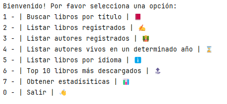
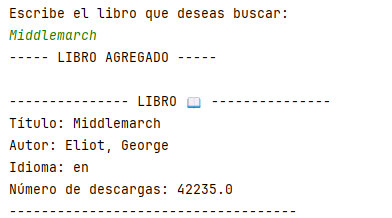
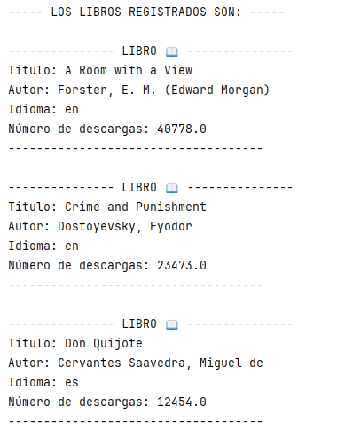
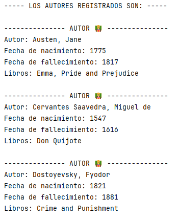
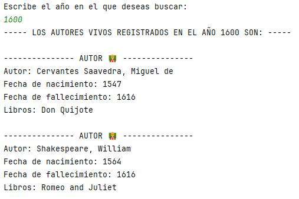
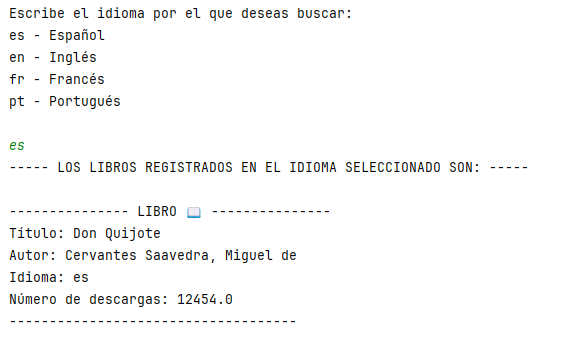
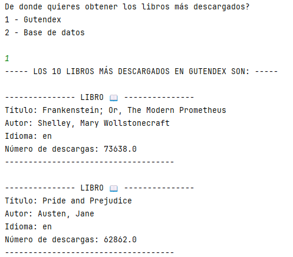
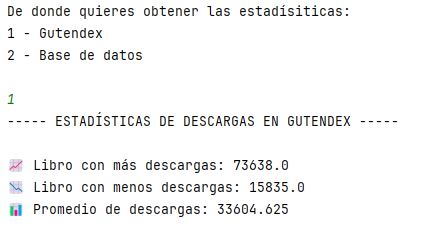

# Desafío literalura

Este proyecto, llamado "Desafío Literalura", fue realizado como parte de la formación en el programa Oracle Next Education (Oracle ONE). Es una aplicación de consola en Java que permite a los usuarios buscar libros por título, listar libros y autores registrados, listar autores vivos en un determinado año, listar libros por idioma, ver los 10 libros más descargados y obtener estadísticas.

## Descripción del proyecto
El proyecto utiliza Java como lenguaje de programación, Spring Boot como framework y Maven para la gestión de dependencias. La estructura del proyecto sigue la estructura estándar de Maven y está organizado en varios paquetes, incluyendo modelos, repositorios y servicios.

La aplicación consume la API de Gutendex para obtener datos de libros y autores, y luego convierte estos datos en objetos de modelo que se pueden manipular dentro de la aplicación. Los datos de los libros y autores se almacenan en una base de datos, lo que permite a los usuarios realizar búsquedas y obtener estadísticas.

La comunicación con la aplicación se realiza a través de la consola, con el siguiente menú: 

                    1 - Buscar libros por título
                    2 - Listar libros registrados
                    3 - Listar autores registrados
                    4 - Listar autores vivos en un determinado año
                    5 - Listar libros por idioma
                    6 - Top 10 libros más descargados
                    7 - Obtener estadísiticas
                    0 - Salir

## Organización del código
El proyecto sigue la estructura estándar de Maven y está organizado en varios paquetes:

- `com.aluracursos.desafio_literalura.models`: Contiene las clases de modelo para Datos, Libros, DatosLibros, Autores y DatosAutores.
  - Datos.java: Record que hace la conexión entre la lista de libros (la cual está contenida en el array "results") del Json y la aplicación.
  - DatosLibros.java: Record que hace la conexión entre los datos de los libros del Json y las variables de la aplicación.
  - DatosAutores.java: Record que hace la conexión entre los datos de los autores de cada libro del Json (los autores y sus datos están dentro de otro array) y la aplicación.
  - Libros.java: Clase que define los atributos de los libros y crea su respectiva tabla en la base de datos. Tiene conexión ManyToOne con el modelo Autores.
  - Autores.java: Clase que define los atributos de los autores y crea su respectiva tabla en la base de datos. Tiene relación OneToMany con el modelo Libros.

- `com.aluracursos.desafio_literalura.repositorio`: Contiene las interfaces de repositorio para interactuar con la base de datos.
  -  IAutoresRepository.java: Repositorio para hacer consultas y busquedas relacionadas con los autores en la base de datos.
  -  ILibrosRepository.java: Repositorio para hacer consultas y busquedas relacionadas con los libros en la base de datos.
  
- `com.aluracursos.desafio_literalura.service`: Contiene las clases de servicio para consumir la API de Gutendex y convertir los datos.
  - ConsumoApi.java: Se encarga de obtener los datos de la API por medio del link proporcionado, y devuelve los datos como Json.
  - ConvierteDatos.java: Se encarga de convertir el Json en una clase (modelo) genérica.
  - IConvierteDatos.java: Esta interfaz se encarga de definir el tipo de dato genérico.

- `com.aluracursos.desafio_literalura.principal`: Contiene la clase Principal que maneja la lógica principal de la aplicación.
  - Principal.java: Es la clase principal de la aplicación que maneja la interacción con el usuario y la ejecución de las funcionalidades, y cada opción mostrada en el menú se realiza con propio método interno, igual definido en principal.

Asimismo, contamos con:
- Las dependencias necesarias:
  - Jackson Dataformat
  - Jackson Core
  - Spring Data JPA
  - PostgreSQL Driver
- La clase de arranque `DesafioLiteraluraApplication`, encargada iniciar la aplicación, crear el contexto de Spring y ejecuta la lógica principal de la aplicación a través de la clase Principal.
- La declaración y configuración de la base de datos en el archivo `application.properties`

## Organización del código de manera gráfica

## Demostración de la aplicación
### Youtube Overview

### General Overview
<table>
  <tr>
    <td>
      
Menú: muestra las opciones a elegir por el usuario

      
    </td>
    <td>
      
Opción 1: buscar libros por título en la API de Gutendex

      
    </td>
  </tr>
  <tr>
    <td>
      
Opción 2: listar libros registrados

      
    </td>
    <td>
      
Opción 3: listar autores registrados

      
    </td>
  </tr>
  <tr>
    <td>
      
Opción 4: listar autores vivos en un determinado año

      
    </td>
    <td>
      
Opción 5: listar libros por idioma

      
    </td>
  </tr>
  </tr>
  <tr>
    <td>
      
Opción 6: Mostrar top 10 libros por deescargas de la API o de la base de datos

      
    </td>
    <td>
      
Opción 7: mostrar estadísitcas

      
    </td>
  </tr>
</table>

